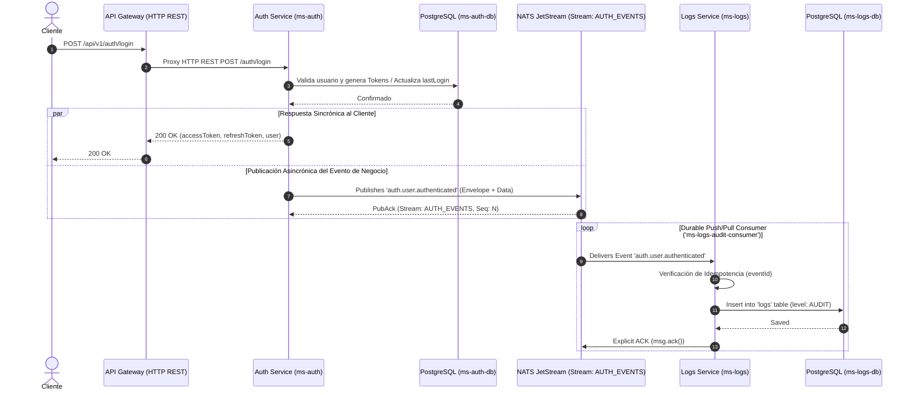

# Guía Arquitectónica: Microservicios Event-Driven con NestJS y NATS JetStream

Esta guía detalla la arquitectura empresarial desacoplada de la plataforma Fintech, explicando el flujo de datos, responsabilidades de cada componente, patrones de diseño aplicados y la integración de **NATS JetStream**.

---

## 1. Visión General de la Arquitectura

La plataforma sigue una **Arquitectura Orientada a Eventos (EDA - Event-Driven Architecture)** combinada con **Microservicios Sincrónicos y Asincrónicos**.



---

## 2. Flujo de Datos Paso a Paso (End-to-End)

1. **Petición del Cliente**: El cliente (Mobile/Web) realiza una solicitud HTTP REST al **API Gateway** (`http://localhost:3000`).
2. **Enrutamiento sincrónico (Gateway → Auth)**:
   - El API Gateway valida reglas de seguridad iniciales (Rate Limiting, CORS, Helmet) y redirecciona la solicitud vía HTTP REST a `ms-auth` (`http://localhost:3001`).
   - El API Gateway **no emite eventos de negocio** ni ejecuta lógica de autenticación directa.
3. **Procesamiento de Negocio (`ms-auth`)**:
   - `ms-auth` procesa la lógica del dominio (ej. valida contraseña con bcrypt, emite JWTs, persiste en PostgreSQL `ms_auth_db`).
4. **Publicación Asincrónica del Evento (`ms-auth` → NATS JetStream)**:
   - Inmediatamente después de completar la transacción de negocio, `ms-auth` invoca a `NatsJetStreamService.publishEvent()`.
   - Se genera un **Envelope de Evento Estándar** con un `eventId` único (UUID v4) y el Subject pasivo `auth.user.authenticated`.
   - El evento se publica en la red de NATS JetStream en el Stream `AUTH_EVENTS`.
5. **Persistencia y Almacenamiento en Stream (NATS JetStream)**:
   - NATS JetStream almacena el evento en disco (`StorageType.File`) garantizando que **ningún evento se pierda** incluso si los consumidores están caídos o si el servidor NATS se reinicia.
6. **Consumo y Auditoría (`ms-logs`)**:
   - `ms-logs` está suscrito mediante un **Durable Consumer** (`ms-logs-audit-consumer`) escuchando el patrón de subjects `auth.user.>`.
   - Al recibir el evento, `ms-logs` verifica si el `eventId` ya fue procesado (**Idempotencia**).
   - Registra la entrada en la tabla `logs` de su propia base de datos PostgreSQL (`ms_logs_db`) etiquetado como `AUDIT`.
   - Responde a NATS JetStream con un **ACK manual explícito** (`msg.ack()`) para confirmar la entrega exitosa.

---

## 3. Componentes y Sus Responsabilidades

### 3.1 API Gateway (`gateway`)
- **Rol**: Punto de entrada único (Reverse Proxy & Ingress Controller).
- **Responsabilidades**:
  - Enrutamiento REST hacia microservicios internos.
  - Rate Limiting (`@nestjs/throttler`).
  - Protección con encabezados HTTP (`helmet`) y gestión de CORS.
  - Futura inyección de Correlation ID (`x-correlation-id`) y validación de API Keys / HMAC / JWT global.
- **Aislamiento**: Desacoplado del bus de eventos NATS.

### 3.2 Auth Service (`ms-auth`)
- **Rol**: Dueño exclusivo del Dominio de Autenticación y Autorización.
- **Responsabilidades**:
  - Gestión de usuarios, Login, Registro, JWT Access & Refresh Tokens, Rotación de Tokens, Blacklist en Redis, y 2FA (TOTP con Speakeasy/QR).
  - Emisor principal de eventos pasados del dominio `auth.user.*`.
- **Eventos Emitidos**:
  - `auth.user.registered`: Cuando un usuario se registra.
  - `auth.user.authenticated`: Al iniciar sesión exitosamente (con o sin 2FA).
  - `auth.user.logout`: Al cerrar sesión y revocar tokens.
  - `auth.user.password.changed` / `auth.user.password.reset`: Operaciones sobre credenciales.
  - `auth.user.2fa.enabled` / `auth.user.2fa.disabled`: Cambios en la configuración de 2FA.

### 3.3 Logs Service (`ms-logs`)
- **Rol**: Microservicio de Auditoría y Logs Centralizados.
- **Responsabilidades**:
  - Consumidor puro (no expuesto vía HTTP al Gateway).
  - Escucha eventos de auditoría de `ms-auth` y en el futuro de `ms-wallet`, `ms-payments`, etc.
  - Garantiza **idempotencia** al verificar `eventId`.
  - Persiste registros en la base de datos de auditoría PostgreSQL (`ms_logs_db`).

### 3.4 Shared Events Library (`libs/events` / `@app/events`)
- **Rol**: Contrato y registro único de eventos compartidos.
- **Responsabilidades**:
  - Catálogo central de nombres de Subjects (`AUTH_SUBJECTS`, `WALLET_SUBJECTS`, etc.) y Streams (`NATS_STREAMS`).
  - Definición de interfaces TypeScript para los Payloads (`UserRegisteredData`, `UserAuthenticatedData`, etc.).
  - **Seguridad**: Garantiza a nivel de diseño que **nunca** se envíen contraseñas, secretos 2FA ni tokens sensibles en el payload de los eventos.

### 3.5 Bus de Eventos NATS JetStream
- **Rol**: Middleware de mensajería persistente para Event-Driven Architecture.
- **Conceptos Clave**:
  - **Stream (`AUTH_EVENTS`)**: Almacenamiento persistente en disco para todos los mensajes bajo el patrón `auth.user.>`.
  - **Subjects**: Tópicos con nomenclatura jerárquica basada en puntos (`auth.user.authenticated`).
  - **Durable Consumer (`ms-logs-audit-consumer`)**: Cursor persistente administrado por NATS que recuerda el último mensaje leído por `ms-logs`. Si `ms-logs` se cae, al reiniciar continúa exactamente desde el último mensaje no confirmado.
  - **ACK Manual Explícito**: El mensaje solo se marca como entregado cuando `ms-logs` ejecuta `msg.ack()`. Si falla el procesamiento en base de datos, se envía `msg.nak(3000)` para reintentar la entrega en 3 segundos.

---

## 4. Estructura del Envelope Estándar de Eventos

Todos los eventos emitidos hacia NATS JetStream cumplen con el siguiente contrato estricto:

```json
{
  "eventId": "e9a3f2b1-4c12-4d98-b801-6789abcdef01",
  "eventType": "auth.user.authenticated",
  "timestamp": "2026-07-24T20:50:00.000Z",
  "producer": "ms-auth",
  "correlationId": "c39a128f-7890-4a12-89bc-1234567890ab",
  "userId": "usr_9981247",
  "application": "ms-auth",
  "ip": "192.168.1.50",
  "userAgent": "Mozilla/5.0...",
  "data": {
    "userId": "usr_9981247",
    "email": "user@fintech.com",
    "authMethod": "password",
    "isTwoFactorPassed": false
  },
  "metadata": {}
}
```

> [!CAUTION]
> **Regla de Oro en Payloads**: El atributo `data` solo debe contener hechos del negocio e información de contexto no sensible. Queda estrictamente prohibido incluir contraseñas en plano, hashes bcrypt, refresh tokens o secretos 2FA.

---

## 5. Patrones Empresariales Aplicados

1. **Idempotencia (At-Least-Once Guarantee)**:
   Debido a que los sistemas distribuidos garantizan entrega *al menos una vez*, `ms-logs` utiliza una restricción de unicidad sobre `eventId` en PostgreSQL. Si NATS entrega dos veces el mismo mensaje por una reconexión de red, la segunda inserción es ignorada sin producir registros duplicados.
2. **Nombres en Tiempo Pasado (Domain Events)**:
   Los eventos representan **hechos del pasado que ya sucedieron** (e.g., `auth.user.registered`, no `registerUser`). Un evento no puede ser cancelado ni rechazado; solo puede ser auditado o reaccionado por otros microservicios.
3. **Abstracción de Módulo en NestJS (`NatsJetStreamModule`)**:
   En lugar de depender de la configuración genérica en memoria de `@nestjs/microservices`, implementamos un servicio dedicado que encapsula el cliente nativo de `nats`, gestionando la creación de Streams, manejo de conectividad y reconexiones automáticas.

---

## 6. Guía de Extensibilidad: Cómo Agregar un Nuevo Microservicio (Ej. `ms-wallet`)

Para integrar un nuevo microservicio como `ms-wallet` a la arquitectura orientada a eventos:

1. **Definir Eventos en `libs/events`**:
   - Agregar los subjects en `constants/subjects.ts` (ej. `wallet.account.created`, `wallet.balance.debited`).
   - Definir los contratos de payload en `contracts/wallet.events.ts`.
   - Declarar el Stream `WALLET_EVENTS` en `NATS_STREAMS`.
2. **Integrar `NatsJetStreamModule` en `ms-wallet`**:
   - Copiar/compartir el `NatsJetStreamModule` en `ms-wallet`.
   - Inyectar `NatsJetStreamService` para publicar eventos cuando un saldo cambie o se cree una cuenta.
3. **Extender `ms-logs`**:
   - En `ms-logs`, agregar una suscripción al patrón `wallet.account.>` con un nuevo Durable Consumer (ej. `ms-logs-wallet-consumer`).
   - `ms-logs` consumirá y guardará automáticamente la auditoría de billeteras sin necesidad de modificar `ms-auth` ni el API Gateway.
