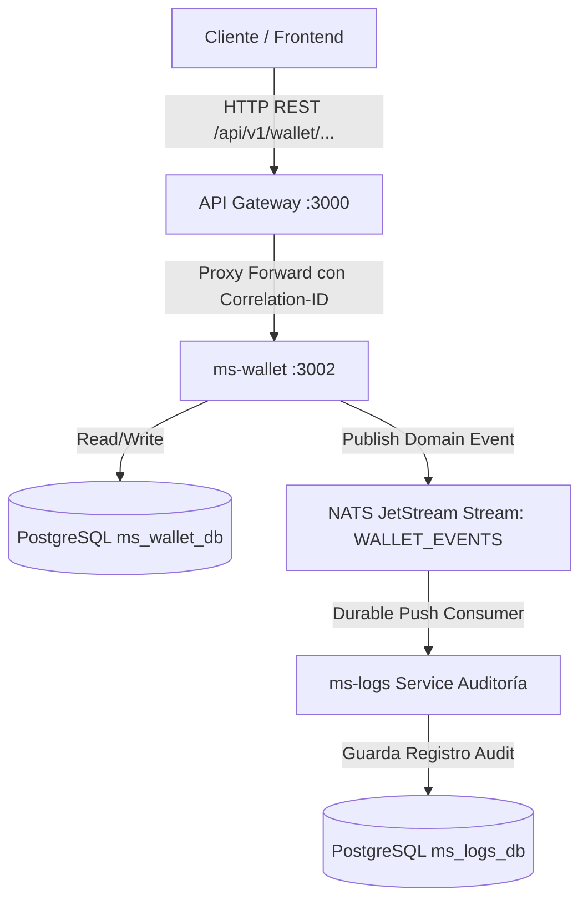

# Guía Detallada: Paso a Paso para Crear e Integrar un Nuevo Microservicio

Esta guía proporciona la metodología completa, patrones de diseño, estructura de archivos y ejemplos prácticos para crear e integrar un nuevo microservicio (usando como ejemplo **`ms-wallet`**) en el ecosistema microservicios orientado a eventos con **NestJS**, **NATS JetStream**, **PostgreSQL**, **TypeORM** y **API Gateway**.

---

## 🏗️ 1. Arquitectura del Nuevo Microservicio



---

## 📌 Lista de Verificación (Checklist de Requisitos)

- [ ] Contratos de eventos registrados en la librería compartida `libs/events`.
- [ ] Base de datos PostgreSQL dedicada e independiente (`ms_wallet_db`).
- [ ] Publicación de eventos con **Envelope Estándar** (`BaseEventPayload`).
- [ ] No transmitir contraseñas, secretos ni datos sensibles en el payload de eventos.
- [ ] Enrutamiento expuesto en el **API Gateway** mediante proxy inverso HTTP.
- [ ] Registro del servicio y contenedores en `docker-compose.yml`.

---

## 🚀 Paso 1: Definir los Eventos y Contratos en la Librería Compartida (`libs/events`)

Todos los eventos del ecosistema deben estar fuertemente tipados en `@app/events`.

### 1.1 Registrar Subjects y Stream en `libs/events/src/constants/subjects.ts`
Agrega las constantes del nuevo microservicio:

```typescript
export const WALLET_SUBJECTS = {
  CREATED: 'wallet.account.created',
  UPDATED: 'wallet.account.updated',
  BALANCE_DEBITED: 'wallet.account.debited',
  BALANCE_CREDITED: 'wallet.account.credited',
} as const;

export type WalletSubject = typeof WALLET_SUBJECTS[keyof typeof WALLET_SUBJECTS];

// Registrar el nuevo Stream en NATS_STREAMS:
export const NATS_STREAMS = {
  AUTH_EVENTS: {
    name: 'AUTH_EVENTS',
    subjects: ['auth.user.>'],
  },
  WALLET_EVENTS: {
    name: 'WALLET_EVENTS',
    subjects: ['wallet.account.>'],
  },
  PAYMENT_EVENTS: {
    name: 'PAYMENT_EVENTS',
    subjects: ['payment.transaction.>'],
  },
} as const;
```

### 1.2 Crear el Contrato en `libs/events/src/contracts/wallet.events.ts`
Crea las interfaces con la estructura del atributo `data`:

```typescript
export interface WalletCreatedData {
  walletId: string;
  userId: string;
  currency: string;
  initialBalance: number;
}

export interface WalletBalanceUpdatedData {
  walletId: string;
  userId: string;
  previousBalance: number;
  newBalance: number;
  amount: number;
  type: 'CREDIT' | 'DEBIT';
}
```

### 1.3 Exportar en `libs/events/src/index.ts` y Compilar
Edita el punto de entrada de la librería:

```typescript
export * from './constants/subjects';
export * from './contracts/base.event';
export * from './contracts/auth.events';
export * from './contracts/wallet.events';
```

Compila la librería para que el resto de microservicios tengan acceso a los tipos:
```bash
cd libs/events
npm run build
```

---

## 📁 Paso 2: Estructura del Proyecto del Nuevo Microservicio (`ms-wallet`)

Crea la carpeta `ms-wallet` en la raíz del repositorio con la siguiente estructura:

```text
ms-wallet/
├── src/
│   ├── common/
│   │   ├── decorators/
│   │   └── nats/
│   │       ├── nats-jetstream.module.ts
│   │       └── nats-jetstream.service.ts
│   ├── config/
│   │   └── configuration.ts
│   ├── database/
│   │   └── migrations/
│   ├── wallet/
│   │   ├── dto/
│   │   │   └── create-wallet.dto.ts
│   │   ├── entities/
│   │   │   └── wallet.entity.ts
│   │   ├── wallet.controller.ts
│   │   ├── wallet.module.ts
│   │   └── wallet.service.ts
│   ├── app.module.ts
│   └── main.ts
├── .env
├── .env.example
├── Dockerfile
├── nest-cli.json
├── package.json
└── tsconfig.json
```

### 2.1 Archivo `ms-wallet/package.json`

```json
{
  "name": "ms-wallet",
  "version": "1.0.0",
  "description": "Microservicio de Gestion de Billeteras y Saldos",
  "scripts": {
    "build": "nest build",
    "start": "nest start",
    "start:dev": "nest start --watch",
    "start:prod": "node dist/main"
  },
  "dependencies": {
    "@app/events": "file:../libs/events",
    "@nestjs/common": "^10.0.0",
    "@nestjs/config": "^3.0.0",
    "@nestjs/core": "^10.0.0",
    "@nestjs/platform-express": "^10.0.0",
    "@nestjs/typeorm": "^10.0.0",
    "class-transformer": "^0.5.1",
    "class-validator": "^0.14.0",
    "nats": "^2.18.0",
    "pg": "^8.11.0",
    "reflect-metadata": "^0.1.13",
    "rxjs": "^7.8.1",
    "typeorm": "^0.3.17"
  },
  "devDependencies": {
    "@nestjs/cli": "^10.0.0",
    "@nestjs/schematics": "^10.0.0",
    "@types/node": "^20.0.0",
    "ts-node": "^10.9.1",
    "typescript": "^5.0.0"
  }
}
```

---

## ⚙️ Paso 3: Configuración de Variables de Entorno y Base de Datos

### 3.1 Archivo `.env` y `.env.example`
Crea `ms-wallet/.env`:

```env
PORT=3002
NODE_ENV=development

# Configuracion de PostgreSQL
WALLET_DB_HOST=localhost
WALLET_DB_PORT=5432
WALLET_DB_USER=postgres
WALLET_DB_PASSWORD=postgres
WALLET_DB_NAME=ms_wallet_db

# Bus de Eventos NATS
NATS_URL=nats://localhost:4222
```

### 3.2 Carga de Configuración (`src/config/configuration.ts`)

```typescript
export default () => ({
  port: parseInt(process.env.PORT || '3002', 10),
  database: {
    host: process.env.WALLET_DB_HOST || 'localhost',
    port: parseInt(process.env.WALLET_DB_PORT || '5432', 10),
    username: process.env.WALLET_DB_USER || 'postgres',
    password: process.env.WALLET_DB_PASSWORD || 'postgres',
    database: process.env.WALLET_DB_NAME || 'ms_wallet_db',
  },
  natsUrl: process.env.NATS_URL || 'nats://localhost:4222',
});
```

### 3.3 Entidad de Base de Datos (`src/wallet/entities/wallet.entity.ts`)

```typescript
import { Entity, PrimaryGeneratedColumn, Column, CreateDateColumn, UpdateDateColumn } from 'typeorm';

@Entity('wallets')
export class Wallet {
  @PrimaryGeneratedColumn('uuid')
  id: string;

  @Column({ name: 'user_id', unique: true })
  userId: string;

  @Column({ type: 'numeric', precision: 12, scale: 2, default: 0 })
  balance: number;

  @Column({ default: 'USD' })
  currency: string;

  @CreateDateColumn({ name: 'created_at' })
  createdAt: Date;

  @UpdateDateColumn({ name: 'updated_at' })
  updatedAt: Date;
}
```

---

## 🔌 Paso 4: Módulo de NATS JetStream para Emisión de Eventos

Crea `src/common/nats/nats-jetstream.service.ts`:

```typescript
import { Injectable, Logger, OnModuleInit, OnModuleDestroy } from '@nestjs/common';
import { ConfigService } from '@nestjs/config';
import { connect, NatsConnection, StringCodec, RetentionPolicy, StorageType } from 'nats';
import { randomUUID } from 'crypto';
import { BaseEventPayload, NATS_STREAMS } from '@app/events';

@Injectable()
export class NatsJetStreamService implements OnModuleInit, OnModuleDestroy {
  private readonly logger = new Logger(NatsJetStreamService.name);
  private nc: NatsConnection;
  private codec = StringCodec();

  constructor(private readonly configService: ConfigService) {}

  async onModuleInit() {
    const natsUrl = this.configService.get<string>('natsUrl') || 'nats://localhost:4222';
    try {
      this.nc = await connect({ servers: natsUrl });
      this.logger.log(`Conectado a NATS JetStream en ${natsUrl}`);
      await this.ensureStreamsExist();
    } catch (error) {
      this.logger.error(`Error de conexion NATS JetStream: ${error.message}`, error.stack);
    }
  }

  async onModuleDestroy() {
    if (this.nc) {
      await this.nc.drain();
      await this.nc.close();
    }
  }

  private async ensureStreamsExist() {
    try {
      const jsm = await this.nc.jetstreamManager();
      const streamConfig = NATS_STREAMS.WALLET_EVENTS;

      try {
        await jsm.streams.info(streamConfig.name);
      } catch {
        await jsm.streams.add({
          name: streamConfig.name,
          subjects: [...streamConfig.subjects],
          retention: RetentionPolicy.Limits,
          storage: StorageType.File,
          max_msgs: -1,
          max_bytes: -1,
          max_age: 0,
        });
        this.logger.log(`Stream [${streamConfig.name}] creado exitosamente.`);
      }
    } catch (error) {
      this.logger.error(`Error asegurando Stream de NATS: ${error.message}`);
    }
  }

  async publishEvent<T>(
    subject: string,
    data: T,
    options?: { userId?: string; correlationId?: string; metadata?: Record<string, any> },
  ): Promise<BaseEventPayload<T> | null> {
    if (!this.nc) return null;

    const payload: BaseEventPayload<T> = {
      eventId: randomUUID(),
      eventType: subject,
      timestamp: new Date().toISOString(),
      producer: 'ms-wallet',
      correlationId: options?.correlationId,
      userId: options?.userId,
      application: 'ms-wallet',
      data,
      metadata: options?.metadata,
    };

    try {
      const js = this.nc.jetstream();
      const pubAck = await js.publish(subject, this.codec.encode(JSON.stringify(payload)), { timeout: 2500 });
      this.logger.log(`[JetStream] Evento publicado '${subject}' | Seq: ${pubAck.seq} | EventID: ${payload.eventId}`);
      return payload;
    } catch (error) {
      this.logger.error(`Fallo al publicar evento en NATS: ${error.message}`);
      return payload;
    }
  }
}
```

Crea `src/common/nats/nats-jetstream.module.ts`:

```typescript
import { Module } from '@nestjs/common';
import { NatsJetStreamService } from './nats-jetstream.service';

@Module({
  providers: [NatsJetStreamService],
  exports: [NatsJetStreamService],
})
export class NatsJetStreamModule {}
```

---

## 💻 Paso 5: Implementar Negocio, Controladores y Módulos NestJS

### 5.1 DTO (`src/wallet/dto/create-wallet.dto.ts`)

```typescript
import { IsNotEmpty, IsNumber, IsOptional, IsString, IsUUID, Min } from 'class-validator';

export class CreateWalletDto {
  @IsUUID()
  @IsNotEmpty()
  userId: string;

  @IsNumber()
  @Min(0)
  @IsOptional()
  initialBalance?: number;

  @IsString()
  @IsOptional()
  currency?: string;
}
```

### 5.2 Servicio (`src/wallet/wallet.service.ts`)

```typescript
import { Injectable, ConflictException, NotFoundException } from '@nestjs/common';
import { InjectRepository } from '@typeorm/nestjs';
import { Repository } from 'typeorm';
import { Wallet } from './entities/wallet.entity';
import { CreateWalletDto } from './dto/create-wallet.dto';
import { NatsJetStreamService } from '../common/nats/nats-jetstream.service';
import { WALLET_SUBJECTS, WalletCreatedData } from '@app/events';

@Injectable()
export class WalletService {
  constructor(
    @InjectRepository(Wallet)
    private readonly walletRepository: Repository<Wallet>,
    private readonly natsService: NatsJetStreamService,
  ) {}

  async createWallet(dto: CreateWalletDto, correlationId?: string): Promise<Wallet> {
    const existing = await this.walletRepository.findOne({ where: { userId: dto.userId } });
    if (existing) {
      throw new ConflictException(`Wallet already exists for user ${dto.userId}`);
    }

    const wallet = this.walletRepository.create({
      userId: dto.userId,
      balance: dto.initialBalance || 0,
      currency: dto.currency || 'USD',
    });

    const savedWallet = await this.walletRepository.save(wallet);

    // Emisión del Evento de Dominio con Envelope
    await this.natsService.publishEvent<WalletCreatedData>(
      WALLET_SUBJECTS.CREATED,
      {
        walletId: savedWallet.id,
        userId: savedWallet.userId,
        currency: savedWallet.currency,
        initialBalance: Number(savedWallet.balance),
      },
      { userId: savedWallet.userId, correlationId },
    );

    return savedWallet;
  }

  async getWalletByUserId(userId: string): Promise<Wallet> {
    const wallet = await this.walletRepository.findOne({ where: { userId } });
    if (!wallet) {
      throw new NotFoundException(`Wallet for user ${userId} not found`);
    }
    return wallet;
  }
}
```

### 5.3 Controlador REST (`src/wallet/wallet.controller.ts`)

```typescript
import { Controller, Post, Get, Body, Param, Headers } from '@nestjs/common';
import { WalletService } from './wallet.service';
import { CreateWalletDto } from './dto/create-wallet.dto';

@Controller('wallets')
export class WalletController {
  constructor(private readonly walletService: WalletService) {}

  @Post()
  async create(
    @Body() dto: CreateWalletDto,
    @Headers('x-correlation-id') correlationId?: string,
  ) {
    return this.walletService.createWallet(dto, correlationId);
  }

  @Get('user/:userId')
  async getByUserId(@Param('userId') userId: string) {
    return this.walletService.getWalletByUserId(userId);
  }
}
```

### 5.4 Módulo `src/wallet/wallet.module.ts`

```typescript
import { Module } from '@nestjs/common';
import { TypeOrmModule } from '@nestjs/typeorm';
import { Wallet } from './entities/wallet.entity';
import { WalletController } from './wallet.controller';
import { WalletService } from './wallet.service';
import { NatsJetStreamModule } from '../common/nats/nats-jetstream.module';

@Module({
  imports: [TypeOrmModule.forFeature([Wallet]), NatsJetStreamModule],
  controllers: [WalletController],
  providers: [WalletService],
})
export class WalletModule {}
```

### 5.5 Módulo Principal `src/app.module.ts`

```typescript
import { Module } from '@nestjs/common';
import { ConfigModule, ConfigService } from '@nestjs/config';
import { TypeOrmModule } from '@nestjs/typeorm';
import configuration from './config/configuration';
import { WalletModule } from './wallet/wallet.module';
import { Wallet } from './wallet/entities/wallet.entity';

@Module({
  imports: [
    ConfigModule.forRoot({ isGlobal: true, load: [configuration] }),
    TypeOrmModule.forRootAsync({
      imports: [ConfigModule],
      inject: [ConfigService],
      useFactory: (config: ConfigService) => ({
        type: 'postgres',
        host: config.get<string>('database.host'),
        port: config.get<number>('database.port'),
        username: config.get<string>('database.username'),
        password: config.get<string>('database.password'),
        database: config.get<string>('database.database'),
        entities: [Wallet],
        synchronize: true,
      }),
    }),
    WalletModule,
  ],
})
export class AppModule {}
```

### 5.6 Punto de Entrada `src/main.ts`

```typescript
import { NestFactory } from '@nestjs/core';
import { ValidationPipe, Logger } from '@nestjs/common';
import { ConfigService } from '@nestjs/config';
import { AppModule } from './app.module';

async function bootstrap() {
  const app = await NestFactory.create(AppModule);
  const configService = app.get(ConfigService);
  const logger = new Logger('Bootstrap');

  app.useGlobalPipes(new ValidationPipe({ whitelist: true, transform: true }));

  const port = configService.get<number>('port') || 3002;
  await app.listen(port);
  logger.log(`ms-wallet corriendo en el puerto ${port}`);
}
bootstrap();
```

---

## 🌐 Paso 6: Configurar el Enrutamiento en el API Gateway (`gateway`)

### 6.1 Actualizar `gateway/.env`
```env
WALLET_SERVICE_URL=http://localhost:3002
```

### 6.2 Modificar `gateway/src/config/services.config.ts`
Registra la nueva ruta y URL del servicio:

```typescript
export const servicesConfig = registerAs('services', () => ({
  authServiceUrl: process.env.AUTH_SERVICE_URL,
  logsServiceUrl: process.env.LOGS_SERVICE_URL,
  walletServiceUrl: process.env.WALLET_SERVICE_URL || 'http://localhost:3002',

  routes: [
    {
      prefix: 'auth',
      targetUrl: process.env.AUTH_SERVICE_URL,
      requiresAuth: false,
      requiresApiKey: false,
    },
    {
      prefix: 'logs',
      targetUrl: process.env.LOGS_SERVICE_URL,
      requiresAuth: true,
      requiresApiKey: false,
    },
    {
      prefix: 'wallet',
      targetUrl: process.env.WALLET_SERVICE_URL || 'http://localhost:3002',
      requiresAuth: true,
      requiresApiKey: false,
    },
  ] as MicroserviceRouteConfig[],
}));
```

### 6.3 Agregar Proxy Handler en `gateway/src/modules/proxy/proxy.controller.ts`

```typescript
  @All(['wallet', 'wallet/*path'])
  proxyWallet(@Req() req: express.Request, @Res() res: express.Response): void {
    this.proxyService.forward('wallet', req, res);
  }
```

---

## 🐳 Paso 7: Dockerización y Orquestación (`docker-compose.yml`)

### 7.1 Archivo `ms-wallet/Dockerfile`

```dockerfile
FROM node:20-alpine AS builder
WORKDIR /app
COPY package*.json ./
COPY ../libs ./libs
RUN npm install
COPY . .
RUN npm run build

FROM node:20-alpine AS runner
WORKDIR /app
COPY package*.json ./
RUN npm install --only=production
COPY --from=builder /app/dist ./dist
EXPOSE 3002
CMD ["node", "dist/main"]
```

### 7.2 Modificar `docker-compose.yml` en la Raíz
Agrega la nueva base de datos PostgreSQL aislada y el contenedor del microservicio:

```yaml
  ms-wallet-db:
    image: postgres:15-alpine
    container_name: ms-wallet-db
    environment:
      POSTGRES_USER: postgres
      POSTGRES_PASSWORD: postgres
      POSTGRES_DB: ms_wallet_db
    ports:
      - "5434:5432"
    volumes:
      - wallet_db_data:/var/lib/postgresql/data

  ms-wallet:
    build:
      context: ./ms-wallet
      dockerfile: Dockerfile
    container_name: ms-wallet
    ports:
      - "3002:3002"
    environment:
      PORT: 3002
      WALLET_DB_HOST: ms-wallet-db
      WALLET_DB_PORT: 5432
      WALLET_DB_USER: postgres
      WALLET_DB_PASSWORD: postgres
      WALLET_DB_NAME: ms_wallet_db
      NATS_URL: nats://nats-server:4222
    depends_on:
      - ms-wallet-db
      - nats-server

volumes:
  wallet_db_data:
```

---

## 🧪 Paso 8: Pruebas de Funcionamiento End-to-End

### 1. Ejecutar Petición a través del Gateway (`:3000`)
```bash
curl -X POST http://localhost:3000/api/v1/wallet/wallets \
  -H "Content-Type: application/json" \
  -H "x-correlation-id: corr-test-998877" \
  -d '{
    "userId": "e9a3f2b1-4c12-4d98-b801-6789abcdef01",
    "initialBalance": 250.00,
    "currency": "USD"
  }'
```

### 2. Flujo Completo Ejecutado:
1. El **Gateway** recibe la petición HTTP en `:3000/api/v1/wallet/wallets`, inyecta/propaga el `x-correlation-id` y redirige la petición vía proxy a `ms-wallet` en `:3002/wallets`.
2. **`ms-wallet`** procesa la regla de negocio, persiste la nueva entidad en la base de datos `ms_wallet_db` y retorna la respuesta HTTP `201 Created`.
3. **`ms-wallet`** publica en background el evento `wallet.account.created` a NATS JetStream en el Stream `WALLET_EVENTS`.
4. El microservicio **`ms-logs`** escucha el patrón `wallet.account.>` y registra la entrada de auditoría garantizando **idempotencia**.
